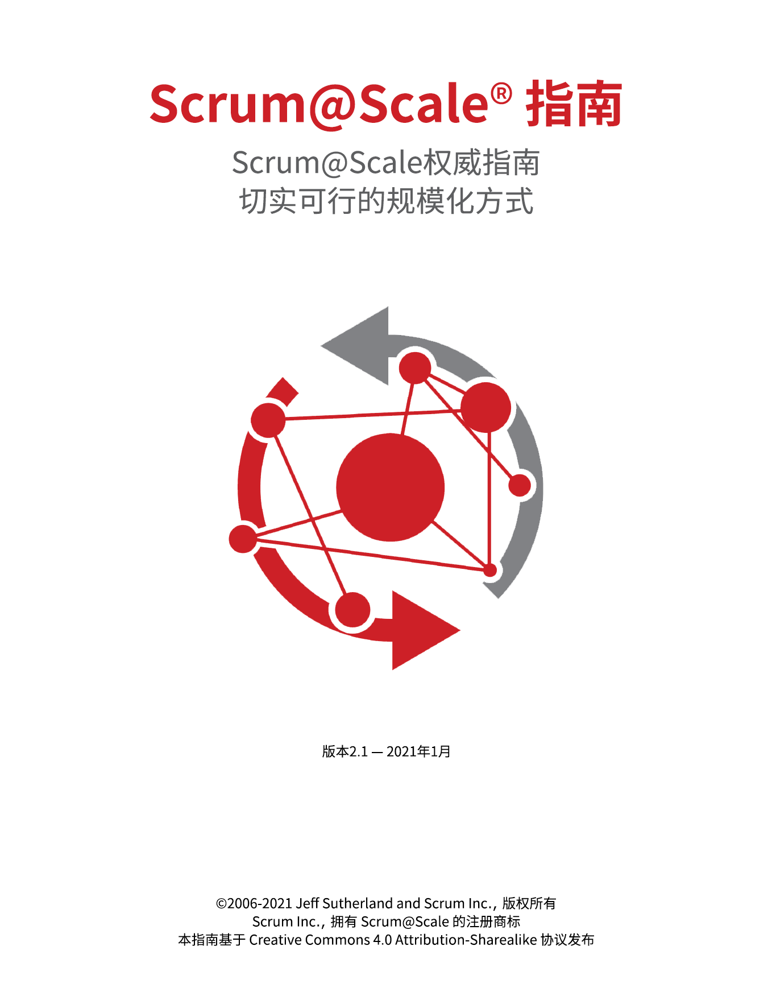
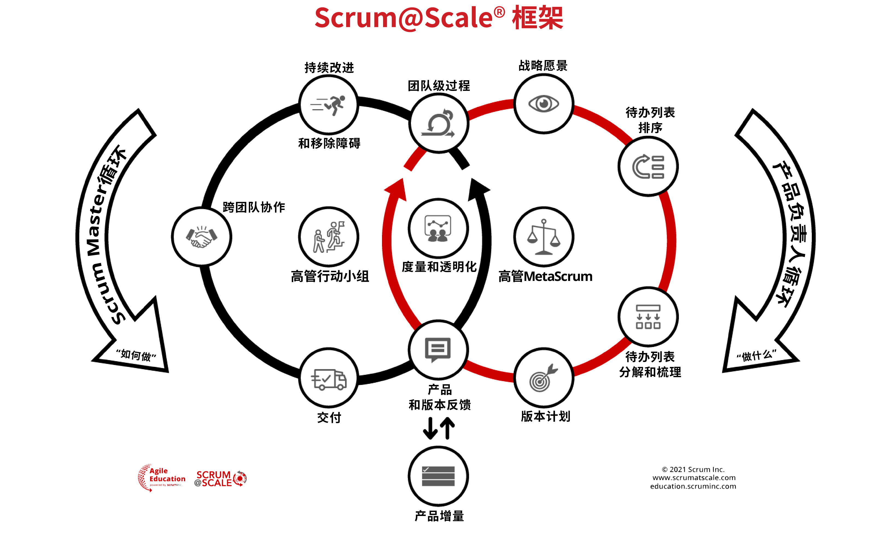
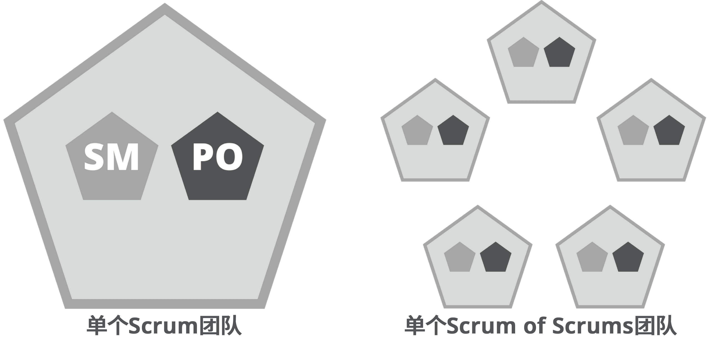
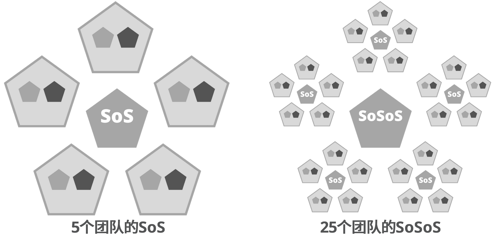

# <u>Scrum@Scale</u>® <u>指南</u>

© 2006-2021 Jeff Sutherland 及 Scrum Inc., 版权所有  
Scrum Inc., 拥有 Scrum@Scale 的注册商标。  
本指南基于"署名-相同方式共享 知识共享4.0" 协议发布 (CC BY-SA 4.0)

简体中文版原创翻译团队：  
申健 Jacky Shen (CST, CTC, Agile Coach)  
王洪亮 Stephen Wang (CSP, Agile Coach)  
李国彪 Bill Li (CST, MBA, Agile Coach)  
孟繁强 Fred Meng (CSP, Agile Coach)

简体中文版授权译文链接：<http://www.uperform.cn/scrum-at-scale-guide-chinese/>，欢迎转载，请保留所有版权信息并遵循共享许可协议进行演绎。

# <u>序言</u>

Scrum，正如最初在Scrum指南中描述的，是专注于单个团队的，使其能够在保持可持续步调的同时交付最优价值。自诞生以来，它的用途已经扩展到需要多个团队协作来实现的产品、流程和服务的创造过程之中。

通过大量的现场观察，随着组织内Scrum团队数量的增加，涌现出两个重要问题：

* 由于跨团队依赖性、重复工作和沟通开销增大等问题，导致每个团队输出（可工作产品）的数量、速度和质量开始下降
* 最初的管理结构对于实现业务敏捷性是无效的。具有竞争关系的优先事项、无法迅速调整团队以应对动态的市场环境等一系列问题随之出现

为了解决这些问题，我们需要一个能够有效协调多个Scrum团队的框架，它的目标应该包括：

* 线性可扩展性：随着团队数量的增加，可工作产品的交付数量也需要有相应比例的增加
* 业务敏捷性：通过对最初的稳定配置进行调整，使其具备快速响应变化的能力[^1]

Scrum@Scale帮助组织将多个Scrum团队组成的网络聚焦于优先考虑的目标上。 它旨在通过建立一种结构，自然地将单个Scrum团队的功能扩展到整个网络中，并将其管理职能放置于"最小可行决策机构(MVB)"之中。[^2]

当一个网络的特征与它的大小无关时，它就具备线性可扩展性。为此目标设计和协调的团队网络，是不会被限制以某种特定的方式扩展的；相反地，它会基于特定的需求，以可持续的步调逐步变化并有机地扩展，从而被与之相关的个体更好地接受。

“最小可行决策机构”是指：在不影响客户价值交付的前提下，为了保障组织功能的正常运转所需的最小数量的组织治理机构和流程。它通过减少决策延迟（决策的时间周期）实现业务敏捷性，这被认为是成功实现业务敏捷性的核心驱动力。[^3]

为了开始实施Scrum@Scale，必须熟悉《敏捷宣言》和2020版《Scrum指南》。 如果无法理解敏捷的本质，将会阻碍敏捷的实施。 如果一个组织不能实施Scrum，就无法对其进行扩展。

# <u>目的</u>

本指南提供了Scrum@Scale框架各个组件的定义。同时，它解释了框架中规模化角色、规模化事件和企业级工件，以及将它们组织在一起的各种规则。

本指南分为四个基本的部分：

* Scrum@Scale的介绍以及入门的基础知识
* Scrum Master循环的概述
* 产品负责人循环的概述
* 两个循环的整合

每个组件都提供了成功实现规模化所需要的特定的用途。改变它们的核心设计或思路，省略它们，或者不遵循本指南中列出的基本规则，都会限制Scrum@Scale的收益。

除了用于实现每个组件的基本结构和规则之外，还有很多本指南中没有介绍到的特定的战术。在其他资料中提供了互补的模式、过程和洞见。

# <u>定义</u>

Scrum 是一个轻量的框架，它通过提供针对复杂问题的自适应解决方案来帮助人们、团队和组织创造价值。

《 Scrum指南》里描述了一个最小元素集合，通过这个集合，可以帮助团队创建一个创新驱动、客户满意、卓越效能和充满幸福感的环境。Scrum利用完全的透明化及一系列正式的活动来提供检视和调整团队及其产品的机会。

Scrum@Scale是一个轻量的组织级框架，在此框架中，遵循Scrum指南的团队网络协作解决复杂自适应问题，同时创造性地交付尽可能高价值的产品。这些"产品"可以是物理上的、数字化的、复杂的集成系统、流程和服务等。

《Scrum@Scale指南》描述了使用Scrum来扩展Scrum的最小的组件集合，以及由此产生的遍及整个组织的业务敏捷性。它可以用于工业、政府、非营利或学术界在内的所有类型的组织。不过，如果一个组织还没有使用过Scrum，那么它需要对其运营系统进行调整（来应用Scrum@Scale）。

在Scrum中，要注意将"做什么"（产品）与"如何做"（过程）区分开。在Scrum@Scale中也是一样的，需要明确地理解管辖权和职责。这样可以移除无谓的组织冲突，从而使团队更容易达到更优的生产效率。Scrum@Scale的所有组件都可以依据组织自身的转型策略和实施模式进行定制，这使得组织有能力实现渐进式转变的目标，先聚焦在最有价值或需求最强烈的领域，然后再向其他领域推进。 

Scrum@Scale将所有组件分布在两个循环中：Scrum Master循环（“如何做”）和产品负责人循环（“做什么”），两个循环有三个共享的组件，其中两个位于循环的相交处。作为一个整体，这些循环形成了一个强大的支持框架，整合多个团队沿着同一路线共同努力。

# <u>组件</u>

## 价值驱动的文化

Scrum@Scale致力于打造基于实验性过程控制的支柱、Scrum价值观的健康的组织文化。实验性过程控制的支柱包括透明、检视和调整，[^4] 它们是通过开放、勇气、专注、尊重和承诺这五大Scrum价值观来实现的。
Scrum@Scale还进一步在实践场景中通过建立价值驱动的文化来打造健康的组织。Scrum的价值观包括：开放、勇气、专注、尊重和承诺。这些价值观驱动着我们基于经验主义作出决策，而经验主义是以透明、检视和调整这三大支柱为基础的。  

开放体现在所有工作和过程的透明性，没有这种透明性，就无法真实地检视它们并进行更好地调整。勇气是以创新的方式更快实现价值所需的大胆飞跃。专注和承诺是将交付客户价值作为最高优先级的工作方式。最后，所有这一切都必须发生在一个尊重每个个体的环境中，没有他们就无法创造任何东西。  

Scrum@Scale通过对积极正向的团队学习环境的支持来帮助组织蓬勃发展，在这种环境里，组织将客户的价值放在首位并保持可持续的步调发展。

## 启动：安装敏捷运行系统

实现团队网络的时候，在扩大规模之前建立一个规模化的参考模型是至关重要的。这个参考模型是一个小的团队集合，他们在每个Sprint相互协作进行交付。随着这些团队成功地实施了Scrum，组织中的其他团队就有了一个有效的、运行良好的Scrum范例可以复制。于是，就可以作为规模化Scrum的原型作用于下一个团队网络。在多团队部署Scrum的时候，Scrum实施中的任何缺陷都会被放大。包括组织的策略和流程或开发实践在内的规模化问题都会阻碍团队绩效并使团队受挫。

在规模化的环境中，将需要协作交付一个完全集成的产品增量的团队分组在一起，以形成Scrum of Scrums（SoS），这是最好地启用参考模型的方式。为了高效地运作，Scrum of Scrums需要得到由两个领导力小组组成的最小可行决策机构的支持：一个是高管MetaScrum（EMS）讨论会，聚焦Scrum of Scrums的产出是什么，另一个是高管行动小组（EAT），聚焦如何能更快地实现这些产出。它们（高管MetaScrum和高管行动小组）是各自循环的中心。

## 扩展团队规模：Scrum of Scrums（SoS）

在Scrum中，理想的状态是让Scrum团队成为通向成果的独立路径。因此，Scrum团队的成员们需要具备从概念到实现所需的所有技能。Scrum of Scrums是一个由多个团队组成的更大的团队，可以规模化地复制这种理想状态。Scrum of Scrums中的每个团队都必须满足"团队级过程"的要求。

## 团队级过程

团队级过程是指以Scrum指南为标准的Scrum。 由于每个Scrum团队都有一个产品负责人和一个Scrum Master，因此它构成了产品负责人循环和Scrum Master循环之间的第一个交叉点。团队级过程的目标包括：

* 已完成和经过质量验证的工作的流动最大化
* 随时间的推移提升团队的绩效
* 以不断充实、可持续的方式运作团队
* 加速客户反馈循环

## Scrum of Scrums（SoS）

Scrum of Scrums的运作模式与一个Scrum团队是一样的，它通过规模化版本的Scrum角色、事件和工件满足"团队级过程"的要求。 尽管《 Scrum指南》将最佳团队规模定义为3到9人，但哈佛的研究 [^5] 发现，最佳团队规模为4.6人（平均值），因此，Scrum of Scrums中的最佳团队规模为4或5。

作为一个充满活力的团队，组成SoS的团队们负责在每个Sprint结束时完全集成一组潜在的可交付产品增量。 最理想的状态是，他们实现了能够给客户直接带来价值的所有功能。

*
注意：在上面和下面的图中，浅灰色的五边形表示一个团队。在这种情况下，我们选择将SM和PO角色表示为较小的五边形。这些图只是作为示例，而对于每个组织来说，结构可能有很大的不同。
*

## 在大型组织中扩展

根据实施内容的规模，可能需要多个Scrum of Scrums协作来交付一个非常复杂的产品。在这种情况下，可以将多个Scrum of Scrums组建成Scrum of Scrum of Scrums(SoSoS)。每一个SoSoS拥有扩展版本的Scrum of Scrums的角色、事件和工件。

通过扩展Scrum of Scrum，可以减少组织内沟通路径的数量，从而限制通信开销的复杂性。SoSoS与Scrum of Scrums交互的方式和Scrum of Scrums与单个Scrum Team交互的方式完全相同，这就提供了线性可扩展性。

*
注意：简单起见，示例图中团队的数量和分组的方式是对称的。 它们仅是示例，事实上每个组织可能会有很大差异。
*

## 扩展事件和角色

如果将Scrum of Scrums(SoS)作为Scrum团队运作，则需要扩展Scrum的事件和团队中相应的角色。SoS通过实施规模化版本的每日立会和Sprint回顾会来协调每个Sprint中的“如何做”。 同样，SoS需要实施规模化版本的Sprint计划会和Sprint评审会来协调每个Sprint中的“做什么”。 此外，还需要持续地实施规模化的待办列表梳理活动。

SoS的Scrum Master被称为Scrum of Scrums Master (简称SoSM)，由他来引导规模化版本的每日立会和Sprint回顾会。产品负责人团队在首席产品负责人(CPO)的指导下，引导规模化版本的Sprint评审会和待办列表梳理活动。而规模化版本的Sprint计划会由产品负责人团队和ScrumMaster们共同引导。对于当前的Sprint，产品负责人团队能够从将要交付的内容中获得洞见，ScrumMster们则能够从容量和技术能力的角度获得洞见。为了能够驱动Scrum@Scale两个循环中的组件，需要将Scrum of Scrums Master和首席产品负责人的角色扩展到相应的领导力小组。

## 事件：规模化每日立会 (SDS)

每日立会的沟通要点是Sprint待办项的进展以及为了完成它们所遇到的障碍。在规模化的环境中，Scrum of Scrums需要了解集体的进步并应对参与团队提出的障碍。 因此，每个团队中至少应有一名代表参加按比例缩放的每日Scrum（SDS）。 参加团队的任何人或人数可以根据需要参加。

## 为什么需要Scrum@Scale?

Scrum专为单个团队而设计，使其能够在保持可持续步调的同时发挥最佳能力。通过实地调查，人们发现随着组织内Scrum团队数量的增加，这些团队的输出（可工作的产品）和速率开始下降（由于跨团队依赖性和重复劳动等问题）。很明显，为了实现线性可扩展性，人们需要一个有效地协调这些团队的框架。Scrum@Scale通过其自由扩展的架构来实现这一目标。

自由扩展的架构通常出现在像人体这样的生物系统中，也出现在需要放置数十亿个晶体管的芯片设计中。互联网的每个节点都与其他节点具有相同的结构，这种设计使互联网能够实现自由的扩展。通过使用自由扩展架构，组织的增长不会受限于一组特定规则所决定的特定方式；相反，它可以有机地基于自己独特的需求增长，并可以维持这种持续的变革步调，从而被组织的成员们接受。Scrum@Scale模型的简洁性对于自由扩展架构来说是至关重要的，而且要谨慎地引入额外的复杂性，避免在扩展团队时导致每个团队的生产率下降。

Scrum@Scale是为组织的整体扩展而设计，包括：所有部门、产品和服务。它可以被运用到不同领域，包括工商业、政府或学术界中的各类组织。Scrum@Scale允许整个组织以更快、更可持续的步调进行更有价值的工作。

## Scrum@Scale的定义

**Scrum：**Scrum是一个框架，在此框架中，人们可以解决复杂自适应问题，同时高效并创造性地交付最高价值的产品或服务。

Scrum指南是Scrum的最小特性集合，它通过检视和适应性的完全透明化，以驱动创新、客户满意度、性能和团队幸福感。

**Scrum@Scale：**Scrum@Scale是一个框架，在此框架中，遵循Scrum指南的多个Scrum团队协作解决复杂的问题，同时高效并创造性地交付最高价值的产品或服务。**注意：**这些"产品"可以是硬件、软件、复杂的集成系统、流程、服务等，取决于这些Scrum团队所处的领域。这些"服务"可以是客户支持服务、维修服务、维护服务或者政府服务。

Scrum@Scale是:  
* 轻量 - 最小可行的决策小组
* 易于理解 - 仅仅包含Scrum团队们
* 难以精通 - 需要实施一个全新的运作模式

Scrum@Scale是一个基于Scrum进行扩展的框架。它通过使用Scrum来扩展Scrum，彻底简化了规模化扩展。
Scrum@Scale的所有组成部件都可以根据组织自身的转型策略和实施模式进行定制。这使得组织有能力将转型聚焦在他们认为最有价值或最需要改变的领域，然后再向其他领域推进。  

在Scrum中，移除障碍是提高团队速度的核心要素。在Scrum@Scale中，移除障碍被大规模地应用，以提高整个组织的速度。

在Scrum中，要注意将“做什么”与“如何做”的职责分开。在Scrum@Scale中也是一样的，需要明确地理解管辖权和职责，从而移除无谓的组织冲突，让团队更容易达到最佳生产效率。

为了分离这两个管辖权，Scrum@Scale建立了两个循环：Scrum Master循环（“如何做”）和产品负责人循环（“做什么”），它们之间有两个交叉点。总之，这些循环造就了一个强大的框架，整合多个团队朝着同一个方向而努力。

当应用Scrum@Scale的时候，组织需要拥有与Scrum角色相匹配的职位。换句话说，如果组织内部使用类似Scrum Master和产品负责人之类的职位，则Scrum@Scale是可以工作的。同样，Scrum@Scale也适用于职位与Scrum角色不匹配的情况。在这种情况下，团队中可能有一个项目经理的职位，但他会以产品负责人的角色服务于Scrum团队。因此，角色和职位之间是没有冲突的。对于规模化扩展Scrum来说，角色和职位的协调性与其他的因素同样重要。特别是在角色（Scrum Master）和职位（区域性管理者）不一致的敏捷组织中，应格外注意角色和职位的协调性。在所有实施Scrum的组织中，治理、角色和职位应该始终保持匹配，在保持团队速度和交付有价值产品或服务能力的状态下扩展Scrum。治理应该解决谁有权移除障碍的问题。

## 价值驱动的文化

除了将“做什么”与“如何做”的职责分开，Scrum@Scale还进一步在实践场景中通过建立价值驱动的文化来打造健康的组织。Scrum的价值观包括：开放、勇气、专注、尊重和承诺。这些价值观驱动着我们基于经验主义作出决策，而经验主义是以透明、检视和调整这三大支柱为基础的。  

开放体现在所有工作和过程的透明性，没有这种透明性，就无法真实地检视它们并进行更好地调整。勇气是以创新的方式更快实现价值所需的大胆飞跃。专注和承诺是将交付客户价值作为最高优先级的工作方式。最后，所有这一切都必须发生在一个尊重每个个体的环境中，没有他们就无法创造任何东西。  

Scrum@Scale通过对变革领导力模型的支持来帮助组织蓬勃发展，这种模型为组织创造了一种积极正向的环境，在这种环境里，组织可以保持可持续的步调并将交付面向客户的价值作为我们努力的首要目标。

# 可扩展的基础结构：Scrum of Scrums

Scrum of Scrums(SoS)由一组相互协作的、共同向客户交付价值的Scrum团队组成。在每个Sprint结束时，SoS负责将每个成员团队的成果完全集成在一起，形成完整的潜在可交付产品增量。SoS的作用类似于发布团队，并且它必须能够直接向客户交付价值。  

Scrum of Scrums的运作模式与一个Scrum团队是相似的，它拥有扩展版本的Scrum角色、事件和工件。 考虑到SoS的可扩展性，还有一些额外的考虑因素。

## SoS的角色

为了在每个Sprint结束时交付完全集成的潜在可交付产品增量，并在必要时促进跨团队协作，SoS需要具备所有必要的技能。(可能包括架构能力、QA能力、产品管理能力以及其他操作能力)

### 产品负责人团队

对于每个SoS，都会将相关的产品负责人组织在一起，形成**产品负责人团队**。他们需要将团队的优先事项与唯一的企业级待办列表保持对齐，这样就可以建立与利益相关者的一致性，并协调SoS中所有Scrum团队的待办列表。

团队级产品负责人负责团队待办列表的维护和排序，他们可能会把共享的SoS待办列表中的待办项拉入到团队待办列表中，或者自行建立独立的待办项。

产品负责人团队的主要职能包括：

* 为产品创建一个对整个组织可见的总体愿景
* 建立并保持与核心利益相关者的一致性，确保他们支持待办列表内容的实现
* 建立一个唯一的，经过排序的待办列表，避免重复的工作
* 采用适当的优先次序对待办列表进行排序，确保障碍得到及时的解决
* 建立一个最小的、统一的、适用于所有团队的“完成的定义"
* 解决团队之间出现的依赖问题
* 建立一个基于协作的版本计划，并对当前版本计划之外的内容作出适当的预测（通常称之为路线图）
* 确定并监控那些能够为理解产品和市场带来洞见的度量指标

就像SoS一样，产品负责人团队采用Scrum团队的方式运作，因此，他们需要有人充当Scrum Master，使团队在讨论过程中始终保持正轨。他们还需要一个人，负责协调为SoS中的所有团队建立唯一的产品待办列表的工作。这个人被指定为**首席产品负责人**。

### 首席产品负责人

## 开始使用Scrum@Scale

在实施大型团队网络时，针对少量团队开发出一个可扩展的参考模型是至关重要的。当部署多个团队时，Scrum实施中的任何缺陷都会被放大。

因此，第一个挑战就是建立少量良好实施Scrum的团队。这组团队克服了那些阻碍敏捷性的组织问题，并为Scrum创建一个在组织中众所周知可运行的参考模型，将其用作整个组织范围内扩展Scrum的模式。

随着团队参考模型的加速，延迟交付、产生浪费或妨碍业务敏捷性的障碍及瓶颈会变得明显。消除这些问题的最有效方法是在整个组织中传播Scrum，以便优化整个价值流。

Scrum@Scale通过使组织浸泡在Scrum中，并有机地分配速度和质量，从而实现了生产力的线性扩展，与组织的特定策略、产品和服务保持一致。

# Scrum Master循环

## 团队级过程

在Scrum指南中明确阐述了**团队级过程**。它由三个工件、五个事件和三个角色组成。团队级过程旨在：

* 最大限度地使完成和通过质量验证的工作流动起来。
* 每个Sprint都提高一点点速率。
* 以一种可持续和丰富的方式运作。

## 整合如何做事(“How”) - Scrum of Scrums

需要协作的多个团队组成一个**“Scrum of Scrums”（SoS）** 。SoS是“团队之团队”[^2]，每天举行一个**规模化每日例会（SDS）**事件，每个团队派代表参加（通常是团队的Scrum Master，尽管任何人都可以参加，也可以派多个人参加）。SDS的存在是为了协调团队并移除障碍以交付价值。

SDS事件反映了每日Scrum例会，优化了团队网络的协作和绩效。另外，SDS：

* 少于15分钟的时间盒。
* 每个团队必须派代表参加。
* 是一个团队代表们解决3个简单问题的论坛：
	* 我的团队有什么障碍阻止了他们完成他们的Sprint目标（或影响即将发布的版本）？
	* 我的团队是否在做任何事情阻止了其他团队完成他们的Sprint目标（或影响他们即将发布的版本）？
	* 我们发现了团队之间的任何新的依赖关系吗，或者找到了解决现有依赖关系的方法吗？

这一组Scrum Master们本身就是一个Scrum团队，负责在每个Sprint末尾从所有参与团队那里完全地集成出一个潜在可交付的产品增量。SoS团队需要实时地应对所有参与团队所提出的障碍。

SoS充当一个发布团队，必须能够直接地向客户交付价值。为了能有效地做到这一点，它需要与Scrum指南保持一致；也就是说，要有自己的角色，工件和事件。这包括一个待办清单梳理事件，他们在其中决定哪些障碍已经“准备好”被移除，最佳移除障碍的方式是怎样的，团队如何才能知道它是“完成”的。要特别关注SoS回顾事件，团队代表们在其中分享各自团队中的任何成功的学习收获或流程改进，以便在SoS中的各个团队能够将这些实践标准化下来。

为了在每个Sprint结束时交付一个完全集成的潜在可交付产品，它需要具备所需的所有技能。它具有产品负责人代表来解决优先级问题。它可能需要经验丰富的架构师，QA负责人和其他操作技能组。当启动Scrum@Scale时，团队们可能还不具备能够支持持续部署的基础架构。这会迫使SoS建立一个“集成团队”或“发布团队”，以完成克服工程缺陷所需的额外工作。SoS被鼓励去激进地解决集成和部署的障碍，因为它创造了一个超高生产力的环境，例如，亚马逊有3300个Scrum团队，平均每秒部署超过一次[^3]。

## Scrum of Scrums Master (SoSM)

SoSM负责联合团队的发布，并且必须：

* 使组织可以看到障碍待办清单。
* 移除团队自己无法解决的障碍。
* 对障碍进行排序，特别要关注跨团队依赖和产品待办清单的分配。
* 提升Scrum of Scrums的效果。
* 与产品负责人们密切合作，每个Sprint部署至少一个潜在可交付的产品增量。
* 利用产品负责人的发布计划来整合多团队的部署工作。

## 扩展SoS

根据组织或实施的规模，可能需要多个SoS来交付非常复杂的产品。在那些情况下，可以从多个Scrum的Scrum中创建一个**Scrum of Scrum of Scrums（SoSoS)**。 SoSoS是Scrum团队的一个有机模式，可以无限扩展。每个SoSoS都应该有SoSoSM角色们，以及每个工件和事件的扩展版本。

扩展SoS减少了组织内部的沟通路径数量，因此复杂性被封装了起来。SoSoS与SoS的接口、SoS与单个Scrum团队的接口，两者都采用了相同的方式，从而实现线性可扩展性。

示例图：

**注意：** 尽管Scrum指南将最优团队规模定义为3到9人，但哈佛大学的研究认为最优团队规模为4.6人。[^4] 针对高绩效Scrum团队的研究一再表明4或5人在一起工作是最优人数。对于SoS中的团队数量，这种模式带来的线性可扩展性是至关重要的。因此，在上图和下图中，选择了五边形来表示一个5人团队。这些图仅仅是示例，您的组织图表可能会有很大差异。

## 高管行动小组

针对整个敏捷组织的Scrum of Scrums被称为高管行动小组（EAT）。EAT是SoS不能移除的那些障碍的终点站。所以，它必须由在政治和财务上得到充分授权的人们组成，去移除那些障碍。EAT的职能是协调多个SoS（或者SoSoS）。和任何Scrum团队一样，它也需要具备一个PO和SM。EAT最好也像Scrum团队一样可以每天见面。每个Sprint他们必须至少见一次面，并且具备一个透明的待办清单。

例图展示了1个EAT，正在协调分布在5个群组中的25个团队

## EAT的待办清单及责任

Scrum是一个区别于传统项目管理的敏捷操作系统。整个SM组织汇报给EAT，后者负责在组织内建立、维护和提升其打造的敏捷操作系统。EAT的角色是创建组织转型待办清单（一份经过排序的列表，包含待完成的敏捷举措）并确保落地执行。例如，如果在一个旧组织中存在一个传统的产品开发生命周期，那么一个新的敏捷产品开发生命周期需要被创建、实现和支持。通常它会比旧方法的更好地支持质量和合规事项，但是需要采纳一套不同的规则和指南来实施。另外，组织发展和治理的很多方面也需要调优。

EAT对于整个组织的Scrum质量负责。它的职责包括但不仅于：

* 为参考模型创建敏捷操作系统，以扩展到整个组织，包括提升敏捷性的企业运营规则，过程和指南。
* 度量和改进组织内的Scrum质量
* 构建组织内业务敏捷的能力
* 创建一个针对Scrum专业人士的持续学习中心
* 支持去探索新型工作方法

最后，EAT必须比照SoS，聚集PO群体来建立和支持相应的的产品负责人组织，从而扩展PO职能。这些PO和关键干系人的团队被称为**MetaScrum**。

## Scrum Master组织的输出/效果

SM组织（SoS、SoSoS和EAT）作为一个整体来完成Scrum Master循环的组件：**持续改进和移除障碍，跨团队协调，和部署**

持续改进和移除障碍的目标是：

* 识别障碍并转化为机遇。
* 维护一个安全的和结构化的环境以排序和移除障碍，并验证和落实改进。
* 确保组织内的可见性以促成变革。

跨团队协调的目标是：

* 协调多个关联团队间的相似流程。
* 管理跨团队依赖以确保它们不会变成障碍。
* 使团队规范和指南的保持对齐，以确保持续的输出。

SoS的目标是像个发布团队一样工作，因此产品部署也是其分内事，而决定发布内容则是PO的分内事。因此，部署的目标是：

* 持续流动式地向客户交付有价值的完成产品。
* 将不同团队的工作集成到一个无缝的产品。
* 确保用户体验的高质量。

# 产品负责人循环

## 整合做什么事(“What”) - MetaScrum

如果一组产品负责人有必要整合一个唯一的待办清单，以供Scrum of Scrums来工作，那么他们自己就形成一个团队称为**MetaScrum**。每个SoS都有一个对应的MetaScrum。MetaScrum沿着同一路径来对齐多个团队的优先级，这样他们就可以整合多个待办清单，并和干系人保持一致以得到他们对待办清单的支持。MetaScrum举行一种规模化的待办清单梳理活动。

* 每个产品负责人（或其代理）都必须参加
* 这个事件是领导者、干系人或其他客户表达各自倾向的论坛

这个事件按需发生，每个Sprint至少发生一次，以确保一个“就绪”的待办清单。MetaScrum的主要职能是：

* 创建产品的主要愿景并且使之对整个组织可见。
* 和干系人保持一致以确保他们支持产品待办清单的实现。
* 创建唯一的排序的待办清单；确保规避了重复工作。
* 针对SoS内所有团队创建统一的“完成的定义”。
* 消除由SoS提出的依赖。
* 生成一份整合的发布计划。
* 监控能够洞察产品的度量，并基于其进行决策。

类似于SoS，多个MetaScrum本身也作为Scrum团队来运作。所以，需要某人来扮演SM来保持团队的正常沟通。他们还需要唯一的人来负责协调，使得MetaScrum覆盖的所有团队创建出唯一的产品待办清单。这个人被指定为**产品总负责人**。

## 产品总负责人(CPO)

通过MetaScrum，产品总负责人与各个团队的产品负责人来协调优先级。他们以干系人以及顾客需求来对齐待办事项的优先级。类似于SoSM，可以是某个团队的PO来扮演这个角色，或者是某个人全职担任这个角色。他们的主要职责和普通PO是一样的，但是在扩展的时候：

* 建立整个产品的战略愿景
* 创建唯一的、排序的待办清单，包含将要被所有团队交付的价值。
* 这些事项对于一个团队的PO来说可以是更大规模的故事。
* 与相应的SoSM紧密工作在一起，以便有效地部署MetaScrum团队创建的发布计划。
* 监控客户对产品的反馈并相应地调整待办清单。

## 扩展MetaScrum

如同SoS可以增长到SoSoS，MetaScrum也可以用同样的机制进行扩展。没有专门的术语对应这些扩展单元，他们的CPO们也没有专门的扩展头衔。我们鼓励每个组织发展自己的方式。下图中，我们选择了再增加一个“总”以突出那些PO。

一些例图：

**注意：** 如上所述，这些多边形代表着理想规模的Scrum团队和MetaScrum。这些图仅仅作为例子，你的组织图可能会显著不同。

## 高管MetaScrum（EMS）

MetaScrum使得PO及其对应的SoS能够以一种网状设计进行无限地扩展。整个敏捷组织的MetaScrum是高管MetaScrum。EMS拥有组织的愿景并设立整个公司的战略优先级，使各个团队围绕共同目标来对齐。

例图展示了1个EMS，正在协调分为5个组的25个团队：

## 产品负责人组织的输出/效果

PO组织(各种MetaScrum，CPO和高管MetaScrum)作为整体来工作以满足产品负责人循环的组件：**战略愿景、待办清单优先级排序、待办清单分解和梳理，以及发布计划**

设置战略愿景的目标是：

* 透过一个共享的路径清晰地对齐整个组织。
* 清晰而有力地表述组织为什么存在。
* 描述组织会做什么从而调度其关键资产以支持其使命。
* 持续更新以响应快速变化的市场情况。

待办清单优先级排序的目标是：

* 针对待交付的产品、功能和服务，识别出一个清晰的排序。
* 待办清单的排序反映了价值创造、风险缓解和内部依赖。
* 在分解和梳理待办清单之前，先在整个敏捷组织内对高层举措进行排序。

待办清单分解和梳理的目标是：

* 把复杂项目和产品分解为独立的可工作元素，每个元素都可以被一个团队在一个Sprint中完成。
* 捕获和提炼涌现的需求和客户反馈。
* 确保所有的待办事项条目是真的“准备就绪”以便被各个团队拉取。

发布计划的目标是：

* 预报关键特性和能力的交付
* 向干系人沟通交付预期
* 按需更新优先级排序

# 连接SM与PO循环

## 理解反馈

**反馈**组件是PO和SM循环所交叉的第二个点。产品反馈通过调整产品待办清单来驱动持续改进，发布反馈通过调整部署机制来驱动持续改进。获取和分析反馈的目标是：

* 验证我们的假设。
* 理解顾客如何使用产品和与产品互动。
* 捕获新特性和新功能的创意。
* 定义针对已有功能的改进。
* 朝着产品/项目完成的方向更新进度，以更好地规划发布计划并与干系人对齐。
* 识别出部署方法和机制的改进项。

## 度量与透明性

彻底的透明性是Scrum最佳状态运作的本质，但是只在能够拥抱Scrum价值观的组织中可行。它使组织能够诚实地评估进度并检视和调整其产品及过程。这是Scrum指南中记载的Scrum的实证主义本性的基石。

SM和PO循环各自需要的度量会分别由SM和PO组织来决策。对于两个特定组织以及那些组织中的特定功能来说，度量也可能是唯一的。Scrum@Scale并不要求任何特定的度量集，但是它推荐了最低配置，即组织应该度量如下方面:

* 生产力 —— 例如，每个Sprint交付的可工作产品的总量变化
* 价值交付 —— 例如，单位团队工作量能够带来的业务价值
* 质量 —— 例如，缺陷率或者服务宕机时间
* 可持续性 —— 例如，团队满意度

设置这些度量指标以及透明性是为了：

* 提供适当的上下文给所有的决策者——包括团队成员在内——以做出优秀的决策。
* 尽量缩短反馈周期以避免矫枉过正。
* 最小化地要求团队、干系人和领导者进行额外投入。

## 关于组织设计的一些说明

Scrum@Scale自由扩展的本性，允许将组织设计为一个个组件，就像框架本身一样。它允许重新平衡和重构团队，从而响应市场。随着组织的增长，分布式团队带来的益处可能也很重要。一些组织在无法获取人才的时候则通过外包开发来扩展和签约。Scrum@Scale展示了如何扩展这种情况，同时避免过长的延迟时间、妥协的沟通以及低劣的质量，使得组织在规模上和地理分布上兼具线性扩展性。[^5]

在这个组织图中，**知识和基础设施团队**表示一些虚拟的专业团队，这些专家的数量太少，难以保证在每个团队中都配备。他们作为一个组与多个Scrum团队进行整合，遵照服务水平协议，每个专业方面请求都流经同一个PO，他将那些请求转换为透明的已排序的待办清单。值得注意的是，这些团队并不是坐在一起的一群各自为政的个体(这是为什么他们被标记为中空多边形)；这些团队成员都坐在实际的Scrum团队当中，但是他们组成这个虚拟Scrum是为了传播待办清单和过程改进。

**客户关系，法务/合规、人力运营**也包含在这里，因为他们是组织中必要的部分，他们将独立于Scrum团队而存在，其他人将依赖于他们。

关于EAT和EMS的最后一点：在这个图中，由于有2个成员同时存在于这两个团队中，所以两者看起来是重叠了。在非常小的组织或者实施中，EAT和EMS可以由同一批人组成。

## 结束语

Scrum@Scale是为了扩展生产力而设计的，使得整个组织在一个显著改善的工作环境中能够高质量地做到事半功倍。在大型组织中适当的应用本框架可以削减产品和服务的成本，并且提升质量和创新。

Scrum@Scale是为了让Scrum浸透组织而设计的。所有团队，包括了领导层、人力资源、法务、咨询和培训，以及产品和服务团队，他们在精简和提升组织的时候都采用同一种Scrum风格。

良好实施的Scrum可以运作起整个组织。

# <u>致谢</u>
## 历史

Jeff Sutherland博士基于Scrum、复杂自适应系统理论、博弈论以及生物学等背后的基础原则开发了Scrum@Scale。本指南的内容来源于许多经验丰富的Scrum实践者的实地工作结果。

## 个人与组织

我们感谢IDX创建了Scrum of Scrums，它允许Scrum扩展到上百个团队，[^6]感谢PatientKeeper创建了MetaScrum，[^7]它使得创新产品能快速部署，感谢OpenView Venture Partners将Scrum扩展到整个组织。[^8] 我们珍视来自英特尔的二万五千多人实施Scrum的输入，教会了我们——“没有事物能扩展”——除了一个自由扩展的架构，还要感谢具有最大的Scrum团队的SAP产品组织，教会了我们让2000多个Scrum团队一起工作的必要因素就是让管理层参与到MetaScrum中。

敏捷教练和培训师们与Jeff Sutherland一起工作，在亚马逊、GE、3M、丰田、Spotify和很多其他公司实施了这些概念，这对于在更广范围的不同领域的公司中验证这些概念是非常有帮助的。

[^1]: "业务敏捷性" Wikipedia, Last modified 27 February 2020 https://en.wikipedia.org/wiki/Business_agility.  
[^2]: 译者注：bureaucracy直译为官僚机构，它的词意来源是"非选举产生的政府机构"或"行政决策小组"  
[^3]: Johnson, Jim. New CHAOS Report. The Standish Group. 2018.
[^4]: Ogunnaike, Babatunde A. and Ray, W. Harmon. Process Dynamics, Modeling and Control. Oxford University Press. 1994.
[^5]: Hackman, J Richard. Leading Teams: Setting the Stage for Great Performances. Harvard Business Press. 2002
